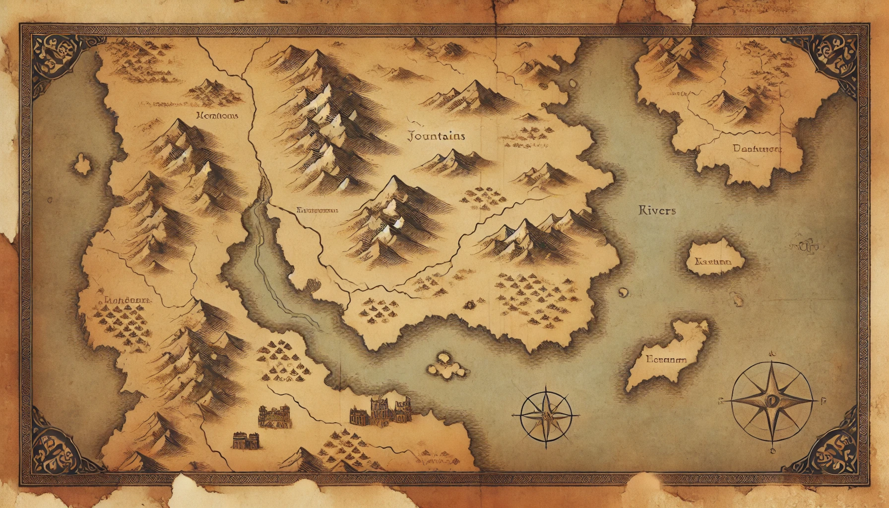

# Davids Demoner Animation

My project for learning and experimenting with SVG files and animating with GSAP.

## 🔗 Links

[Github Repositorie](https://github.com/Davkje/Svg-Learning/)

[Github Pages](https://davkje.github.io/Svg-Learning/) - *Live version of the project*

## Preview

Preview av sidan. Länk till github pages finns ovan.


## AI Bild



Jag valde att generera en bild med hjälp av DALL-E som skulle skapa lite textur och djup till bakgrunden snarare än att själv stå i fokus. Eftersom sidan och loggan är inspirerad av fantasy och Dungeons & Dragons så valde jag att prompta en genererad karta över ett fantasiland. Jag bad om något väldigt simpelt, inte så detaljerat med pergament-textur och det tycker jag absolut att den lyckades med.  
 Jag gjorde dock ett par försök och försökte få en karta med mindre info och bad om en karta utan hav och det var den helt inkapabel till att göra. Det säger väll något om vad AI'n är matad med för information och eftersom de flesta kartor har någon typ av vatten så var det näst intill omöjligt att få bort. 


## Tech Stack

**Languages:** JavaScript, HTML, CSS (Sass)  

**Framework:** Vue  

**Build Tool:** Vite  

**Dependencies:**  
- Sass (SCSS compiler)  
- Vue TSC (TypeScript type checking) 

<br/>

[](https://skillicons.dev)


## Project Setup

```sh
pnpm install
```

### Compile and Hot-Reload for Development

```sh
pnpm dev
```

### Type-Check, Compile and Minify for Production

```sh
pnpm build
```

### Lint with [ESLint](https://eslint.org/)

```sh
pnpm lint
```